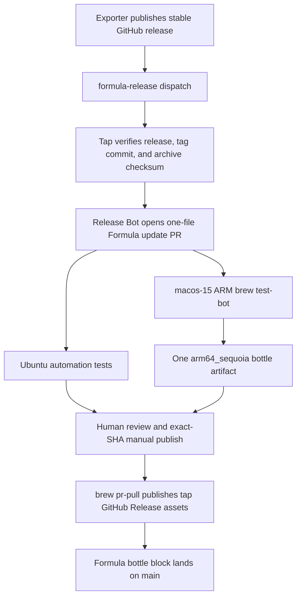

# Tap-owned exporter formula and bottle automation plan

## Status

The automation foundation is merged. The current pull request rescope is in
progress: Airplan remains an upstream-managed Cask, while macOS Battery
Exporter becomes the tap's only source Formula and receives one Apple Silicon
macOS 15 bottle.

The first exporter bottle and first automated exporter update remain manually
gated. Trusted automatic bottle publication is a later phase and is not part of
the current pull request.

## Goals

- Keep `Casks/airplan.rb` generated by Airplan's GoReleaser release process.
- Own `Formula/macos-battery-exporter.rb` in this tap.
- Build exporter releases from source using Homebrew's current Go toolchain.
- Publish exporter bottles as public assets on formula-specific GitHub
  Releases in this repository.
- Build one `arm64_sequoia` bottle on GitHub's standard `macos-15` runner.
- Let exporter releases request a narrowly validated Formula update pull
  request in this repository.
- Keep bottle publication unprivileged during pull-request testing and
  manually gated until the end-to-end path has been exercised.

## Non-goals

- Converting Airplan to a Formula.
- Building Airplan from source in this tap.
- Replacing Airplan's GoReleaser Cask publication.
- Providing exporter bottles for Intel, Linux, or Apple Silicon Sonoma.
- Supporting macOS versions that Homebrew itself does not support.
- Adding automatic `workflow_run` publication in the current pull request.
- Changing either upstream repository in the current pull request.

## Confirmed decisions

1. Airplan stays a GoReleaser-managed Cask.
2. macOS Battery Exporter becomes a tap-owned source Formula.
3. Bottles use this tap's GitHub Releases, not GHCR.
4. The bottle builder is the pinned standard `macos-15` Apple Silicon runner.
5. Each exporter version has only an `arm64_sequoia` bottle.
6. Apple Silicon macOS 14 and every Intel Mac build the exporter from source.
7. The Formula uses Homebrew's current Go build dependency rather than the old
   Go version in the exporter repository.
8. Initial publication uses a manual `brew pr-pull` workflow.
9. Future automatic publication must revalidate the exact tested pull request
   head and may only publish trusted Release Bot updates.
10. Airplan requires no upstream changes for this project.

## Package ownership

| Package | Definition | Build source | Update owner |
|---|---|---|---|
| Airplan | `Casks/airplan.rb` | Upstream release archives | Airplan GoReleaser |
| macOS Battery Exporter | `Formula/macos-battery-exporter.rb` | Tagged source archive | This tap |

Airplan remains installable with:

```sh
brew install jimeh/tap/airplan
```

The exporter supports a normal install, an explicit source build, and `HEAD`:

```sh
brew install jimeh/tap/macos-battery-exporter
brew install --build-from-source jimeh/tap/macos-battery-exporter
brew install --HEAD jimeh/tap/macos-battery-exporter
```

## Exporter Formula

`Formula/macos-battery-exporter.rb` should contain:

- The tagged GitHub source archive URL and SHA-256.
- `head` pointing at the upstream `main` branch.
- `depends_on :macos`.
- `depends_on "go" => :build`.
- A `CGO_ENABLED=0` build using `std_go_args`.
- The existing Homebrew service definition.
- A version test that does not require a running metrics server.
- A generated `bottle do` block after the first bottle is published.

The Formula deliberately compiles with the Go version supplied by Homebrew.
The project is pure Go and its release binary is statically linked, so the old
Go version recorded by the upstream repository is not a reason to pin an old
compiler here.

The legacy root-level `macos-battery-exporter.rb` points at a prebuilt universal
archive. It is removed when the source Formula lands under `Formula/`.

## Bottle support policy

| Host | Installation for new exporter releases |
|---|---|
| Apple Silicon, macOS 15 or newer | Pour `arm64_sequoia` bottle |
| Apple Silicon, macOS 14 | Build from source |
| Intel, any Homebrew-supported macOS | Build from source |
| macOS 13 or older | Unsupported by this tap |

Homebrew may use the Sequoia bottle on a newer same-architecture macOS release.
It cannot use that bottle on Sonoma or Intel. The support statement therefore
describes macOS 15 or newer as bottled without promising a distinct bottle for
every future release.

This is a rolling bottle floor. The workflow stays pinned to `macos-15` rather
than `macos-latest` so the generated tag is predictable. Before GitHub removes
that runner, move to a newer pinned runner and document the corresponding new
source-build floor. Existing bottles remain available for their versions.

The source-build cost is acceptable for the unsupported bottle combinations.
The exporter itself compiles quickly; most first-install overhead comes from
downloading Homebrew's Go build dependency.

## Architecture



Airplan is outside this flow. Its upstream GoReleaser process continues to
write `Casks/airplan.rb` directly as it does today.

## Pull-request test workflow

`.github/workflows/tests.yml` has exactly two required jobs:

| Job ID | Required check | Runner | Purpose |
|---|---|---|---|
| `automation-tests` | `automation tests` | `ubuntu-latest` | Ruby tests, syntax, actionlint |
| `test-bot-macos` | `brew test-bot (macos-15-arm64)` | `macos-15` | Homebrew checks and bottle |

The macOS job:

1. Sets up the tap with Homebrew's maintained action.
2. Confirms Homebrew's Ruby reports an ARM64 host.
3. Runs test-bot cleanup, setup, and stable tap syntax checks.
4. Uses `brew test-bot --only-formulae-detect` on pull requests.
5. Runs `brew test-bot --only-formulae` for changed Formulae.
6. Requires exactly one bottle JSON file when the exporter is selected.
7. Uses Homebrew's Ruby to require exactly the `arm64_sequoia` bottle tag.
8. Requires zero bottle JSON files for Cask-only pull requests.
9. Uploads bottle files under the deterministic artifact name
   `bottles_macos-15-arm64`.

There is no matrix, Rosetta Homebrew, Intel job, Linux Homebrew job, or custom
runner label. Ubuntu remains only for fast repository automation tests.

The tap syntax command deliberately uses `--stable`. Homebrew's full tap syntax
mode styles every definition, but the byte-for-byte upstream-generated Airplan
Cask has two legacy style violations. Stable mode retains all-platform
`brew readall` validation, but skips tap-wide style, audit, and typecheck. That
tradeoff avoids taking ownership of the generated Cask; the later formula step
still styles, audits, builds, bottles, reinstalls, and tests every changed
exporter Formula.

The bottle job has no write permissions. A pull request, including one from a
fork, can build an artifact but cannot publish a release or update `main`.

## Bottle storage

Use formula-specific GitHub Releases in `jimeh/homebrew-tap`, for example:

```text
https://github.com/jimeh/homebrew-tap/releases/download/
  macos-battery-exporter-0.0.7/
```

The release contains the bottle archive produced by test-bot. The Formula's
generated `bottle do` block records the release root URL, SHA-256, and
`arm64_sequoia` tag.

GitHub Releases is preferred because it is the default layout produced by
`brew tap-new` and works directly with `brew test-bot` and `brew pr-pull`.
It also makes assets and release history visible without introducing an OCI
registry publishing path. GHCR remains a possible future migration, not part
of this design.

## Formula update workflow

`.github/workflows/update-formula.yml` accepts either a manual dispatch or a
`formula-release` repository dispatch containing:

```json
{
  "formula": "macos-battery-exporter",
  "version": "0.0.7",
  "tag": "v0.0.7",
  "commit": "<full lowercase commit SHA>",
  "source_run": "https://github.com/jimeh/macos-battery-exporter/actions/runs/<id>"
}
```

Only `macos-battery-exporter` is allowlisted. Requests naming `airplan`, path
traversal variants, unknown packages, prereleases, malformed versions, or
non-lowercase commit SHAs fail before modifying a file.

For an accepted request, the updater independently:

1. Resolves the allowlisted upstream repository and Formula path.
2. Requires a published, non-draft, non-prerelease release for `v<version>`.
3. Resolves the tag and requires the supplied full commit SHA.
4. Downloads the tagged source archive over HTTPS and computes its SHA-256.
5. Rechecks the upstream release after the download to detect a moved tag.
6. Updates only the supported source URL and SHA-256.
7. Removes the old bottle block so test-bot produces metadata for the new
   version.
8. Refuses downgrades and makes an identical-version replay a no-op.
9. Opens a same-repository pull request under
   `automation/macos-battery-exporter-<version>`.
10. Adds the `automated-formula-update` label.

The update uses a short-lived GitHub App token created from:

- Repository variable `RELEASE_BOT_CLIENT_ID`.
- Repository secret `RELEASE_BOT_PRIVATE_KEY`.

The app should have only the repository permissions needed to write the update
branch and open the pull request. The dispatch payload is a request, not trusted
release evidence.

## Manual bottle publication

The existing `brew pr-pull` workflow is the bootstrap publication path. A
maintainer supplies both the pull request number and the exact tested head SHA.
The workflow:

1. Runs only from `main` through `workflow_dispatch`.
2. Validates that the SHA is a full lowercase commit SHA.
3. Fetches artifacts and check data with the repository token.
4. Runs `brew pr-pull --head-sha=<sha>` for the selected pull request.
5. Publishes the bottle on a formula-specific tap release.
6. Merges bottle metadata into the Formula.
7. Pushes the resulting commit to `main`.

This workflow is privileged and must be invoked only after reviewing the pull
request and confirming both required checks succeeded at the supplied SHA.

## Future trusted automatic publication

Automatic publication may be added only after manual update and bottle cycles
have demonstrated the full path. It should be triggered from completed test
workflow evidence, not from executable code in the update pull request.

Before publishing, `PublishValidator` must require all of the following:

- The pull request is open and based on `main`.
- Its author is the configured Release Bot GitHub App.
- Its head repository is `jimeh/homebrew-tap`, not a fork.
- Its branch is exactly
  `automation/macos-battery-exporter-<version>`.
- It has the `automated-formula-update` label.
- It changes exactly `Formula/macos-battery-exporter.rb`.
- The successful workflow is `.github/workflows/tests.yml`, triggered by that
  pull request in `jimeh/homebrew-tap`.
- The workflow head SHA exactly matches the current pull request head SHA.
- Exactly one successful check exists for each required check name:
  `automation tests` and `brew test-bot (macos-15-arm64)`.
- The upstream repository, tag, resolved commit, release state, and archive
  checksum still match the requested release.
- The Formula diff is exactly the allowed URL/SHA update and bottle-block
  removal.
- The previous Formula already had reviewed bottle metadata; first bottles
  remain on the manual path.

The privileged workflow must check out trusted code from `main`, download the
artifact associated with the exact validated run, and fail closed if any
identity or evidence is missing or ambiguous. It must never run pull-request
code with a write token.

## Upstream integration

### Airplan

No change is required. GoReleaser continues to generate and publish
`Casks/airplan.rb` from Airplan releases. Airplan is not accepted by this tap's
Formula updater and does not produce a bottle here.

### macOS Battery Exporter

After the source Formula and first bottle are verified, update the exporter
repository in a separate pull request:

1. Stop GoReleaser from publishing its legacy binary Formula to this tap.
2. Preserve its normal release binaries unless the project separately decides
   to remove them.
3. Add a post-release `formula-release` repository dispatch to this tap.
4. Send only the exporter name, version, tag, commit, and optional source run.
5. Use a narrowly scoped credential that can dispatch to this tap but cannot
   write its contents.

The tap continues to resolve and verify all security-sensitive release state.

## Rollout and progress

### Phase 1: automation foundation

- [x] Add the allowlisted update workflow and release verification.
- [x] Add formula transformation tests and hostile-input coverage.
- [x] Add the manually invoked `brew pr-pull` publisher.
- [x] Add the future trusted-publish validator without wiring automatic
  publication.
- [x] Configure the Release Bot variable, secret, and update label.

### Phase 2: exporter-only rescope

- [x] Decide that Airplan remains a GoReleaser Cask.
- [x] Decide on one `arm64_sequoia` exporter bottle from `macos-15`.
- [x] Restore `Casks/airplan.rb` unchanged from `main`.
- [x] Remove `Formula/airplan.rb` and Airplan updater fixtures.
- [x] Keep `Formula/macos-battery-exporter.rb` and remove the root legacy
  Formula.
- [x] Restrict the updater and validator fixtures to the exporter.
- [x] Replace the bottle matrix with one pinned macOS 15 ARM job.
- [x] Keep the generated Airplan Cask unchanged by using stable tap syntax;
  retain full changed-Formula checks in the bottle step.
- [x] Update documentation and required-check coupling.
- [x] Pass local automation tests, Ruby syntax, actionlint, and diff checks.
- [ ] Pass pull-request CI and review.

The implementation is complete locally. The rescope remains in progress until
the revised pull request has passed review and CI.

### Phase 3: first exporter bottle

- [ ] Review the open exporter source Formula pull request and obtain green CI.
- [ ] Run manual `brew pr-pull` against its exact tested head SHA while the
  pull request remains open; let that workflow publish and integrate it.
- [ ] Confirm the tap release contains one public bottle asset.
- [ ] Confirm the generated Formula block contains only `arm64_sequoia`.
- [ ] Test a clean ordinary install on Apple Silicon macOS 15 or newer and
  confirm Homebrew pours the bottle.
- [ ] Test `--build-from-source` and the Homebrew service.

### Phase 4: exporter-triggered updates

- [ ] Change the exporter repository in a separate pull request.
- [ ] Trigger one update through `workflow_dispatch`.
- [ ] Trigger at least one real update through `repository_dispatch`.
- [ ] Confirm the update pull request changes only the exporter Formula.
- [ ] Manually publish and verify its replacement bottle.

### Phase 5: trusted automatic publication

- [ ] Review evidence from the manual update cycles.
- [ ] Add the guarded privileged publication trigger separately.
- [ ] Confirm fork and human pull requests cannot reach publication.
- [ ] Confirm stale, duplicate, failed, or ambiguous checks fail closed.
- [ ] Confirm the exact tested artifact is the one published.

## Verification

### Repository automation

Run locally and in CI:

```sh
ruby -c lib/homebrew_tap/automation.rb
ruby -c script/update-formula
ruby -c script/validate-publish
for test_file in test/*_test.rb; do ruby -c "$test_file"; done
for test_file in test/*_test.rb; do ruby -Itest "$test_file"; done
go run github.com/rhysd/actionlint/cmd/actionlint@v1.7.7
git diff --check
```

Tests must cover:

- Only the exporter is allowlisted; Airplan and hostile path-like names fail.
- Stable-version, tag, commit, source-run URL, and repository validation.
- Release verification before and after archive download.
- Exact Formula URL/SHA changes and bottle-block removal.
- Replay no-op and downgrade rejection.
- Future publisher identity, branch, label, exact-SHA, workflow, check, upstream,
  and one-file diff validation.
- Required check names matching the two workflow job names.

### Homebrew Formula and bottle

On the `macos-15` pull-request runner:

```sh
brew test-bot --only-cleanup-before
brew test-bot --only-setup
brew test-bot --only-tap-syntax --stable
brew test-bot --only-formulae-detect
brew test-bot --only-formulae
```

For an exporter change, require one bottle JSON file whose only tag is
`arm64_sequoia`. For an Airplan Cask-only change, require zero bottle JSON
files. Upload any generated bottle files as `bottles_macos-15-arm64`.

After publication, verify:

- The release asset is public and its digest matches the Formula metadata.
- A clean Apple Silicon macOS 15 or newer install says it is pouring a bottle.
- `macos-battery-exporter -v` matches the Formula version.
- An explicit source install succeeds with Homebrew's current Go.
- `brew services start jimeh/tap/macos-battery-exporter` uses the expected
  service command.

### Source-only combinations

Where practical, exercise source installs on Apple Silicon Sonoma and Intel.
These platforms do not need CI bottle artifacts. Failure to obtain a Go build
dependency on a Homebrew-unsupported macOS version is outside this tap's
support policy.

## Failure and rollback behavior

- A failed source build or bottle job leaves an open pull request and publishes
  nothing.
- A Cask-only pull request producing a bottle fails validation.
- A missing or non-Sequoia exporter bottle fails validation.
- Invalid upstream evidence fails before a Formula edit or bot branch push.
- A stale pull-request SHA cannot be supplied silently to manual publication.
- Automatic publication remains absent until the separate trust-gate phase.
- A bad unpublished update can be fixed in its pull request and rerun.
- A bad published bottle can be corrected with a Formula revision and bottle
  rebuild; do not silently replace an asset without matching metadata.
- Airplan rollback remains an upstream GoReleaser/Cask concern and is
  independent of exporter bottle rollback.

## Expected repository changes

The exporter-only migration should leave this package layout:

```text
Casks/
└── airplan.rb
Formula/
└── macos-battery-exporter.rb
```

The resulting repository includes the automation foundation alongside that
package layout:

```text
.github/workflows/tests.yml
.github/workflows/update-formula.yml
.github/workflows/publish.yml
lib/homebrew_tap/automation.rb
script/update-formula
script/validate-publish
test/*
```

Relative to `main`, the current pull request replaces the legacy root exporter
Formula with the source Formula under `Formula/`, narrows the updater and its
tests to the exporter, reduces bottle CI to one macOS 15 ARM job, removes stale
actionlint runner labels, and updates the README and this plan. The Airplan Cask
is unchanged.

There should be no `Formula/airplan.rb`, Airplan Formula updater fixture,
Rosetta setup, Intel bottle job, Linux bottle job, or custom actionlint runner
label.

## References

- [Homebrew Formula Cookbook](https://docs.brew.sh/Formula-Cookbook)
- [Homebrew Bottles](https://docs.brew.sh/Bottles)
- [Homebrew `brew test-bot`](https://docs.brew.sh/Manpage#test-bot-options)
- [Homebrew `brew pr-pull`](https://docs.brew.sh/Manpage#pr-pull-options-pull_request)
- [Homebrew support tiers](https://docs.brew.sh/Support-Tiers)
- [Homebrew tap actions](https://github.com/Homebrew/actions)
- [GitHub-hosted runners](https://docs.github.com/en/actions/reference/runners/github-hosted-runners)
- [Airplan release configuration](https://github.com/jimeh/airplan/blob/main/.goreleaser.yaml)
- [Exporter release configuration](https://github.com/jimeh/macos-battery-exporter/blob/main/.goreleaser.yml)
