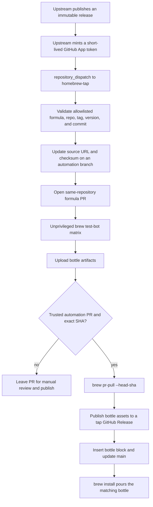

# Tap-owned formulae and bottle automation plan

Date: 2026-07-14

Status: Foundation [PR #1](https://github.com/jimeh/homebrew-tap/pull/1) is
merged. Source formula migration and initial bottle work is in progress in
[PR #3](https://github.com/jimeh/homebrew-tap/pull/3).

## Recommendation

Replace both GoReleaser-generated package definitions with source-based formulae
owned by this repository, and use Homebrew's standard pull-request bottle flow.

The recommended shape is:

- Keep formula source and release policy in `jimeh/homebrew-tap`.
- Build tagged source archives with Homebrew's current unversioned `go` formula.
- Publish bottles as public assets on formula-specific GitHub Releases in this
  tap repository.
- Let upstream release jobs send a narrow `repository_dispatch` event containing
  only the formula name, version, tag, and released commit.
- Turn each event into a same-repository formula update PR.
- Build bottles in an unprivileged PR workflow.
- Automatically publish only trusted, machine-generated update PRs after all
  bottle jobs pass and after revalidating the exact PR head SHA and diff.
- Retain Homebrew's manual `brew pr-pull` workflow for recovery and human-made
  formula changes.

This gives normal users fast bottle installs while preserving:

```sh
brew install jimeh/tap/airplan
brew install --build-from-source jimeh/tap/airplan
brew install --HEAD jimeh/tap/airplan
```

The same applies to `macos-battery-exporter`, except it remains macOS-only.

## What exists today

The tap currently contains no workflows and has two different generated
package shapes:

| Project | Current definition | Current input | Platforms |
| --- | --- | --- | --- |
| Airplan | `Casks/airplan.rb` | GoReleaser binary archives | macOS and Linux, Intel and ARM |
| macOS Battery Exporter | root `macos-battery-exporter.rb` formula | GoReleaser universal binary archive | macOS only |

Both upstream GoReleaser configurations write directly to this tap. The tap
therefore owns neither the source build recipe nor its release automation.

Other relevant findings:

- `main` has no branch protection or ruleset at present.
- Actions are enabled, third-party actions are allowed, and the default
  `GITHUB_TOKEN` permission is read-only.
- Airplan v0.1.0 uses Go 1.26.5 and stamps
  `github.com/jimeh/airplan/cli.version` at build time.
- The exporter declares Go 1.21.4, but its source is pure Go with Darwin build
  tags and `CGO_ENABLED=0` in GoReleaser.
- The exporter builds successfully for both `darwin/amd64` and `darwin/arm64`
  with Go 1.26.5. The formula does not need or want a `go@1.21` dependency.
- Homebrew core Go formulae conventionally use
  `depends_on "go" => :build` and `std_go_args`; this always selects the current
  Homebrew Go toolchain.
- Current source archive checksums, useful for the bootstrap PR, are:
  - Airplan v0.1.0: `6ef89558c9340f73f1bbbec23d4e089f58cc34e2443303964dba4137f52eb27f`
  - Exporter v0.0.6: `a6477d67cd7e4253b548fccd9bbd9214c473c21a45bb6894a8265e5709124a3e`

## Target lifecycle



Source builds and bottle builds use the same formula `install` method. Bottles
are cached results of that source build, not upstream GoReleaser binaries.

## Supported bottle matrix

Start with this matrix:

| Runner | Bottle tag | Airplan | Exporter |
| --- | --- | ---: | ---: |
| `macos-14`, native Apple Silicon | `arm64_sonoma` | yes | yes |
| `macos-14`, Intel Homebrew under Rosetta | `sonoma` | yes | yes |
| `ubuntu-latest` in Homebrew's container | `x86_64_linux` | yes | skipped |
| `ubuntu-24.04-arm` in Homebrew's container | `arm64_linux` | yes | skipped |

This preserves Airplan's existing four OS/architecture combinations without a
paid Intel runner. The two macOS jobs use the same standard, GitHub-hosted
Apple Silicon Sonoma runner. The native job uses `/opt/homebrew`. The Intel job
installs a second Homebrew in `/usr/local`, invokes it through
`arch -x86_64`, and builds inside Rosetta 2. Homebrew then generates the normal
Intel `sonoma` tag rather than an artificial cross-compiled archive.

The current core Go formula provides both `arm64_sonoma` and `sonoma` bottles,
so both jobs can use Homebrew's normal bottle-only build-dependency policy. The
workflow verifies the active Homebrew prefix and Ruby host CPU before running
test-bot, then verifies every generated bottle JSON contains the matrix's exact
expected tag. Each job also derives its expected bottle count from test-bot's
detected formula set before artifact upload. The initial migration expects two
bottles in each macOS job and one in each Linux job.

Homebrew can select an older compatible macOS bottle for a newer macOS release
when the architecture matches. These Sonoma bottles therefore cover Sonoma and
later macOS releases for both architectures. They do not cover an older macOS
release than Sonoma.

This is a deliberately time-limited free-runner strategy. GitHub began
deprecating `macos-14` on July 6, 2026 and plans to remove it on November 2,
2026. Before removal, refresh this matrix. The cost-free fallback is to move
the same native/Rosetta pairing to `macos-15`; new formula versions would then
have Sequoia bottles, and Sonoma users would build those versions from source.
Continuing to publish new Sonoma bottles after the runner disappears requires
access to a Sonoma builder, such as a self-hosted Mac or a paid macOS service.
Existing published Sonoma bottles remain available for their formula versions.

The official `brew tap-new` template currently includes Apple Silicon macOS,
Intel macOS, and x86-64 Linux; Linux ARM and the Rosetta replacement for the
paid Intel runner are the intentional extensions. GitHub provides
`ubuntu-24.04-arm`, so Linux ARM also does not require a self-hosted runner.

The exporter remains macOS-only through `depends_on :macos`. Homebrew's test bot
should load and audit it on Linux but skip its build there.

Runner and OS labels will age. Treat the current output of `brew tap-new` as the
baseline whenever the workflow matrix is refreshed instead of freezing the
labels in this plan forever.

## Formula definitions

Move all formulae into `Formula/`:

```text
Formula/
├── airplan.rb
└── macos-battery-exporter.rb
```

Delete `Casks/airplan.rb` and the root `macos-battery-exporter.rb` once the new
formulae and bottle workflow land together.

### `Formula/airplan.rb`

The formula should contain:

- A literal GitHub tag source URL, initially
  `https://github.com/jimeh/airplan/archive/refs/tags/v0.1.0.tar.gz`.
  The updater replaces the version in this URL on each release.
- The downloaded source archive SHA-256.
- License, description, and homepage copied from the project.
- `head "https://github.com/jimeh/airplan.git", branch: "main"`.
- `depends_on "go" => :build`.
- A version-specific GitHub Releases root URL in the generated `bottle do`
  block. The initial formula does not need an empty bottle block;
  `brew pr-pull` inserts the complete block with its checksums.
- A source build using `std_go_args` and the same version symbol GoReleaser
  currently stamps.
- A test that checks `airplan --version` without requiring S3 credentials.

The core of the recipe should be equivalent to:

```ruby
depends_on "go" => :build

def install
  ldflags = "-s -w -X github.com/jimeh/airplan/cli.version=#{version}"
  system "go", "build", "-buildvcs=false", *std_go_args(ldflags:)
end

test do
  assert_match version.to_s, shell_output("#{bin}/airplan --version")
end
```

Confirm argument ordering against the Homebrew version used by CI when
implementing. The desired output binary is `bin/airplan`, which `std_go_args`
derives from the formula name.

### `Formula/macos-battery-exporter.rb`

The formula should contain:

- A literal GitHub tag source URL, initially
  `https://github.com/jimeh/macos-battery-exporter/archive/refs/tags/v0.0.6.tar.gz`.
  The updater replaces the version in this URL on each release.
- The downloaded source archive SHA-256.
- `head`, license, description, and homepage.
- `depends_on :macos`.
- `depends_on "go" => :build`, deliberately not `go@1.21`.
- The same tap GitHub Releases storage convention as Airplan.
- The existing service definition.
- A safe version-only test.

The source build should be equivalent to:

```ruby
depends_on :macos
depends_on "go" => :build

def install
  ENV["CGO_ENABLED"] = "0"
  ldflags = "-s -w -X main.version=#{version}"
  system "go", "build", *std_go_args(ldflags:)
end

service do
  run [opt_bin/"macos-battery-exporter", "-s"]
  keep_alive true
  process_type :background
end

test do
  assert_match version.to_s,
               shell_output("#{bin}/macos-battery-exporter -v")
end
```

Use the exact service DSL accepted by the current Homebrew audit. Preserve the
existing `-s` behavior; add logging or restart policy only if desired as a
separate service-policy choice.

Leave the exporter's `main.commit` as `unknown` in a stable archive build rather
than stamping the tap commit or another misleading value. If showing the
upstream commit in `-v` becomes important, add it as explicit formula metadata
maintained by the trusted updater.

The project can independently update `go.mod` and upstream CI to current Go,
but that is not a prerequisite for the tap migration. The formula's unversioned
build dependency already builds it with Homebrew's current Go. A later upstream
maintenance change should replace `actions/setup-go`'s `1.21` pin with the
project's chosen current-version policy and add tests, but the tap should not
silently edit upstream module metadata during packaging.

## Bottle storage

### Selected: public GitHub Releases

Generate the workflow baseline with:

```sh
brew tap-new jimeh/homebrew-tap
```

Do this in a temporary location and copy/adapt only the generated workflow
files; do not reinitialize this existing repository.

For a formula version, Homebrew derives a release root such as:

```text
https://github.com/jimeh/homebrew-tap/releases/download/airplan-0.1.0
```

`brew pr-pull` creates one tap release per formula version and uploads each
platform bottle as a release asset. The formula's generated `bottle do` block
stores the release root, exact per-platform SHA-256 values, and `cellar`
relocation declarations. Homebrew selects and downloads the matching asset
automatically.

This is Homebrew's default third-party tap path and requires no package-specific
setup:

- Bottle downloads are ordinary public HTTPS release assets.
- The publish job needs `contents: write`, which it already needs to update the
  tap, but no `packages` permission.
- No package visibility change or registry credential is required.
- `brew test-bot --only-formulae` derives the release root automatically for a
  non-core tap.
- Public GitHub release assets have a 2 GiB per-file limit, up to 1,000 assets
  per release, and no total storage or bandwidth limit. These Go bottles will
  be far below the per-file limit.

The tradeoff is repository presentation: the tap's Releases page will contain
entries such as `airplan-0.1.0` and `macos-battery-exporter-0.0.6`. That is
acceptable because this repository exists specifically to distribute Homebrew
packages.

### Rejected alternative: GitHub Packages

GHCR remains fully supported through `brew tap-new --github-packages`, and its
OCI layout keeps bottle artifacts out of the Releases page. It was rejected for
this tap because it adds package permissions, registry authentication in CI,
and a manual public-visibility step for every newly created personal-account
package without giving these two small Go formulae a material installation
benefit. The storage choice can be revisited without redesigning source builds
or upstream dispatch.

## Tap workflows

### 1. `.github/workflows/tests.yml`

Base this on the current default `brew tap-new` template.

Triggers:

- `pull_request`
- `push` to `main`

Jobs:

1. On the Intel Sonoma entry, install `/usr/local` Homebrew under Rosetta and
   put an `arch -x86_64` wrapper first on `PATH`.
2. Set up the selected Homebrew with `Homebrew/actions/setup-homebrew`.
3. Verify the selected prefix and Homebrew Ruby host architecture.
4. Cache Homebrew's Bundler gems using only the generated safe cache path.
5. Run `brew test-bot --only-cleanup-before`.
6. Run `brew test-bot --only-setup`.
7. Run `brew test-bot --only-tap-syntax`.
8. On pull requests, run `brew test-bot --only-formulae`; Homebrew derives the
   version-specific tap release URL.
9. Require the expected bottle count and platform tag, then upload
   `*.bottle.*` as one artifact per matrix entry, even when a later test
   step fails, so failures are diagnosable.

Security properties:

- `contents`, `pull-requests`, checks, and actions are read-only.
- No App private key or package-write token is available.
- Do not use `pull_request_target`.
- Do not restore caches into paths from which the privileged publish job later
  executes code.
- Pin third-party actions by full commit SHA and keep a version comment beside
  each pin.

### 2. `.github/workflows/update-formula.yml`

Triggers:

```yaml
on:
  repository_dispatch:
    types: [formula-release]
  workflow_dispatch:
    inputs:
      formula: ...
      version: ...
      tag: ...
      commit: ...
```

The manual trigger is the operational fallback and must run the same validation
and update code as the external trigger.

Use a concurrency group per formula so two releases for the same formula cannot
race.

Implement an allowlist rather than accepting repository or path input:

| Formula input | Required upstream repo | Required tag |
| --- | --- | --- |
| `airplan` | `jimeh/airplan` | `v<version>` |
| `macos-battery-exporter` | `jimeh/macos-battery-exporter` | `v<version>` |

Validation must:

1. Reject unknown formula names and malformed SemVer values.
2. Derive the repository, formula path, URL template, and tag from the allowlist.
3. Query GitHub for the release and tag; require a published, non-draft,
   non-prerelease release unless prereleases are explicitly added later.
4. Require the tag's resolved commit to equal the dispatched commit.
5. Download the tag archive itself and compute SHA-256 in the tap workflow.
   Never trust a checksum supplied by the caller.
6. Refuse downgrades and no-op cleanly if the formula is already at that
   version.
7. Refuse an update if another open automation PR already targets that formula,
   unless the workflow is explicitly superseding an older version.

After validation:

1. Create `automation/<formula>-<version>` from current `main`.
2. Run `brew bump-formula-pr --write-only --version=<version>` against the
   tap-qualified formula, or a small tap-owned updater if Homebrew cannot
   express the URL update reliably.
3. Verify that the diff changes only the expected formula's version URL,
   source checksum, and existing bottle block removal.
4. Run `brew style` and `brew audit --strict` before pushing.
5. Commit with `chore(<formula>): update to <version>` or the repository's
   chosen conventional equivalent.
6. Push and open a same-repository PR using a short-lived Release Bot GitHub App
   token, not the default `GITHUB_TOKEN`.
7. Apply a reserved label such as `automated-formula-update` and include the
   upstream release URL, tag commit, source SHA-256, and dispatch correlation in
   the PR body.

Using the App token matters because GitHub applies special recursion and
approval behavior to PR events created with `GITHUB_TOKEN`. A dedicated App
also allows repository and permission scope to remain narrow.

Put allowlist and mutation logic in a tested script such as
`script/update-formula`; keep YAML responsible for orchestration only. A
fixture-based test should prove that hostile names, paths, versions, and
repositories cannot escape the allowlist or alter workflow files.

### 3. `.github/workflows/publish.yml`

Preserve the official manual interface:

```text
workflow_dispatch(pull_request, head_sha)
```

The implementation should use Homebrew's current generated sequence:

1. Set up Homebrew.
2. Configure the Git author.
3. Run
   `brew pr-pull --debug --tap="$GITHUB_REPOSITORY" --head-sha="$HEAD_SHA" "$PR"`.
4. Push the resulting commits to `main` with Homebrew's guarded push action.

`brew pr-pull` retrieves bottle artifacts from `tests.yml`, merges their JSON
metadata into a `bottle do` block, uploads the bottles, and creates the tap
commit. Passing `--head-sha` binds publication to the reviewed and tested PR
revision.

Permissions belong only here:

- `actions: read` to fetch bottle artifacts
- `checks: read`
- `contents: write`
- `pull-requests: write`

### 4. Trusted automatic publication

Homebrew's generated publish workflow is manual. To satisfy the requested
end-to-end upstream release flow, add a second entry point that runs after a
successful `tests.yml` `workflow_run` and delegates to the same publication
logic.

This is the highest-risk part of the design because `workflow_run` receives a
write token and secrets after an unprivileged workflow. GitHub explicitly warns
about this privilege boundary. The automatic path must not merely trust a PR
label.

Before invoking `brew pr-pull`, require every condition below:

- The completed workflow conclusion is `success`.
- It is associated with exactly one open pull request.
- The PR head repository is `jimeh/homebrew-tap`, never a fork.
- The head branch matches `automation/<allowlisted-formula>-<semver>`.
- The PR author is the configured Release Bot App.
- The reserved automation label is present.
- The current PR head SHA exactly equals the tested workflow head SHA.
- GitHub reports all required matrix jobs successful for that SHA.
- The diff changes exactly one `Formula/*.rb` file and no workflow, script, or
  configuration file.
- A tap-owned validator confirms the old/new formula diff contains only the
  expected version URL, source checksum, and removal of old bottle metadata.
- Re-querying the upstream tag and release still yields the recorded commit.

Do not check out or execute code from the PR before validation in this
privileged job. Check out the default branch, query PR metadata through the API,
and download artifacts to a temporary non-executable directory. Only after the
exact diff passes validation should `brew pr-pull --head-sha` consume the PR and
bind publication to the verified SHA.

If any automatic check fails, make no write and leave the PR open. The manual
publish workflow then provides a clear recovery path after review.

An even safer first rollout is to keep publication manual for the first few
releases, observe the exact generated diffs and artifacts, then enable the
automatic `workflow_run` entry point. This delays full automation but reduces
bootstrap risk. The final design still supports the requested full chain.

## Upstream project integration

Both projects should stop asking GoReleaser to mutate the tap.

### Airplan

Change its release configuration and workflow to:

- Remove `homebrew_casks` from `.goreleaser.yaml`.
- Remove `HOMEBREW_TAP_GITHUB_TOKEN` from the GoReleaser step.
- Keep GoReleaser binary archives, checksums, SBOMs, attestations, and release
  publication unchanged; they remain useful non-Homebrew distribution assets.
- After the release is successfully published and made immutable, mint a
  short-lived installation token for only `jimeh/homebrew-tap` and dispatch
  `formula-release` with `formula=airplan`, version, tag, and commit.

Airplan already uses a Release Bot GitHub App for its release and tap access,
so this changes the token's purpose rather than introducing a long-lived PAT.

### macOS Battery Exporter

Change its release configuration and workflow to:

- Remove the `brews` stanza from `.goreleaser.yml`.
- Remove `BREW_TAP_TOKEN` from GoReleaser.
- After GoReleaser successfully publishes the GitHub release, mint the same
  narrowly scoped Release Bot installation token and dispatch
  `formula-release` with `formula=macos-battery-exporter`.
- Prefer the GitHub App over preserving the legacy long-lived tap token.

Separately, modernize this project's Go policy:

- Build CI and releases with the current stable Go release.
- Keep `go.mod`'s `go` directive at the minimum language/module semantics the
  source genuinely needs, or intentionally advance it if dropping older Go is
  acceptable.
- Add a two-architecture Darwin compile check and unit tests where practical.

That upstream cleanup is worthwhile but can be a follow-up PR. The tap formula
will already use current Homebrew Go from day one.

### Dispatch payload

Keep the payload small and informational:

```json
{
  "event_type": "formula-release",
  "client_payload": {
    "formula": "airplan",
    "version": "0.1.1",
    "tag": "v0.1.1",
    "commit": "<40-character commit SHA>",
    "source_run": "https://github.com/jimeh/airplan/actions/runs/<id>"
  }
}
```

The tap derives everything security-sensitive from its allowlist and GitHub's
release/tag state. `source_run` is only for traceability.

The upstream action calls:

```text
POST /repos/jimeh/homebrew-tap/dispatches
```

Use a GitHub App installation token scoped to the tap. Do not share the tap's
own `GITHUB_TOKEN` or a broad personal access token with upstream jobs.

## Repository settings

Before enabling automatic publication:

1. Install/configure the Release Bot App for all three repositories.
2. Grant only the permissions needed for dispatch, tap branch writes, and PR
   creation. Bottle release upload stays in the tap's own `GITHUB_TOKEN` job.
3. Add the App client ID as a repository variable and private key as an Actions
   secret where token minting is required.
4. Create `automated-formula-update` as a reserved label.
5. Configure a `main` ruleset requiring the Homebrew test workflow while
   allowing only the guarded bottle publisher or Release Bot to bypass for the
   final `brew pr-pull` commit.
6. Keep default workflow permissions read-only and declare elevated permissions
   per job.
7. Enable Dependabot or Renovate for GitHub Actions pins.

Do not turn on a branch rule that silently blocks `brew pr-pull`; test the
ruleset and bypass identity with a dry-run formula PR before enforcing it.

## Progress tracker

Update this section whenever work starts, a PR changes state, or verification
produces a durable result. Link PRs and workflow runs here once they exist.

- [x] Inspect current tap and both upstream release configurations.
- [x] Verify the exporter builds for Darwin Intel and ARM with Go 1.26.5.
- [x] Agree on GitHub Releases for bottle storage.
- [x] Confirm Linux ARM bottles, `--HEAD`, separate exporter modernization, and
  manual publication for the first one or two generated updates.
- [x] Split bootstrap into a foundation PR and formula migration PR.
- [x] Select native and Rosetta builds on the standard `macos-14` runner for
  cost-free `arm64_sonoma` and `sonoma` bottles, with a documented November
  2026 refresh deadline.
- [x] Implement and locally verify the tap foundation changes on
  `feat/homebrew-tap-foundation`. Ruby tests, syntax checks, and actionlint
  pass; the pull request matrix owns `brew test-bot` verification.
- [x] Open, review, and merge foundation
  [PR #1](https://github.com/jimeh/homebrew-tap/pull/1).
- [ ] Implement the source formula migration. In progress in
  [PR #3](https://github.com/jimeh/homebrew-tap/pull/3); formula definitions
  are complete and the revised macOS bottle matrix is being verified.
- [ ] Build, publish, and verify the initial bottles and tap releases.
- [x] Configure the Release Bot client ID variable, private key secret, and
  reserved `automated-formula-update` label.
- [ ] Verify Release Bot permissions during tap-side dispatch validation.
- [ ] Validate tap-side manual and repository-dispatch updates.
- [ ] Update Airplan release integration.
- [ ] Update macOS Battery Exporter release integration.
- [ ] Modernize exporter Go and CI in a separate PR.
- [ ] Observe one or two manually published generated formula updates.
- [ ] Enable and verify trusted automatic publication and the `main` ruleset.

## Migration sequence

### Phase 1: Foundation PR

1. Generate current workflow templates in a temporary tap using `brew tap-new`.
2. Add `tests.yml` and the manual `publish.yml`.
3. Add the allowlisted updater and trusted-publish validator scripts with tests.
4. Add `update-formula.yml`. Keep `publish.yml` manual-only; the validator is
   prepared for the later automatic publication phase but has no privileged
   automatic trigger yet.
5. Update the README and this implementation tracker without changing the
   installed package definitions.
6. Open, review, and merge the foundation PR into `main`.

Until Phase 2 creates `Formula/*.rb`, the test matrix performs Homebrew setup
but skips tap syntax and formula builds. The legacy generated exporter cannot
pass current cross-platform `brew readall`; the file-existence gate removes
itself automatically when the source formulae land.

The split is required because GitHub only allows manual dispatch of a workflow
that already exists on the default branch. Merging this PR first makes
`publish.yml` available to publish the bottles built by the migration PR.

### Phase 2: Formula migration and initial bottles PR

1. Add the two hand-owned source formulae under `Formula/`.
2. Remove the Airplan cask and root generated exporter formula.
3. Update installation and Airplan cask-migration documentation.
4. Let the PR matrix build all initial platform bottles.
5. Review the formulae, checks, and exact PR head SHA.
6. Manually run the already-merged `publish.yml` with that PR and head SHA.
7. Confirm the tap releases and assets exist and the resulting formulae contain
   complete bottle blocks.

This bootstraps source formulae and bottles through the same path later updates
will use, without depending on the Release Bot App.

### Phase 3: Tap-side update automation validation

1. Configure the Release Bot App variables and secrets.
2. Exercise `workflow_dispatch` against the already-current versions; expect a
   validated no-op.
3. Exercise it with a temporary test tag or the next real release.
4. Publish the first one or two generated update PRs manually.

### Phase 4: Upstream dispatch PRs

1. Remove tap-generation stanzas from each GoReleaser configuration.
2. Add post-publication dispatch to Airplan.
3. Add post-publication dispatch to the exporter.
4. Verify duplicate dispatches are idempotent.

Keep exporter Go and CI modernization in a separate upstream PR.

### Phase 5: Automatic trusted publication

1. Add the `workflow_run` entry point and strict PR validator.
2. Test rejection with a fork PR, human PR, extra-file diff, changed head SHA,
   failed matrix job, and forged label.
3. Test acceptance with a Release Bot update PR.
4. Enable the `main` ruleset only after the complete path succeeds.

## Verification strategy

### Formula checks

For each formula and supported platform:

```sh
brew style jimeh/tap/airplan
brew audit --strict --online jimeh/tap/airplan
brew install --build-from-source jimeh/tap/airplan
brew test jimeh/tap/airplan
brew uninstall jimeh/tap/airplan
brew install jimeh/tap/airplan
brew test jimeh/tap/airplan
```

Repeat for `macos-battery-exporter` on macOS. Confirm the source install output
shows compilation and the normal install output shows `Pouring ...bottle...`.

Also check:

- `airplan --version` matches the formula version.
- `macos-battery-exporter -v` matches the formula version.
- `brew services start jimeh/tap/macos-battery-exporter` starts the expected
  command and `brew services stop` cleans it up.
- `brew install --HEAD` builds the current default branch for both formulae.
- A bottle created on each runner can be reinstalled from its local file before
  publication.

### Workflow checks

- Formula PRs produce all expected bottle artifacts.
- The native Sonoma job reports `/opt/homebrew`, `arm64`, and
  `arm64_sonoma`; the Rosetta job reports `/usr/local`, `x86_64`, and
  `sonoma`.
- Exporter PRs skip Linux without failing the matrix.
- Airplan emits both x86-64 and ARM64 Linux bottle metadata.
- `brew pr-pull --head-sha` rejects a stale or changed SHA.
- Each tap release contains all expected platform bottle assets and is publicly
  downloadable.
- A fresh machine with no tap clone can run
  `brew install jimeh/tap/airplan` and receive a bottle.
- Deleting local Homebrew caches before the fresh install proves the bottle is
  coming from the tap release rather than cache.

### Automation security and idempotency checks

- Unknown formula, malformed version, mismatched tag, missing release,
  prerelease, and mismatched commit all fail before a branch is written.
- The workflow computes rather than accepts source SHA-256.
- Replaying a completed dispatch is a no-op.
- A newer dispatch supersedes or clearly blocks behind an open older update;
  it never races it.
- Human and fork PRs can build bottles but can never auto-publish them.
- Any validator ambiguity fails closed and preserves the manual path.

## Airplan cask migration impact

New installs keep the desired command:

```sh
brew install jimeh/tap/airplan
```

Existing cask installations do not automatically become formula installations.
Document a one-time migration:

```sh
brew uninstall --cask airplan
brew install --formula jimeh/tap/airplan
```

Test the exact token qualification during the migration PR because Homebrew's
formula/cask token resolution can be confusing while an old tap checkout still
contains the cask. Mention the migration in the README and Airplan release
notes. Do not keep both definitions indefinitely under the same token.

Moving the exporter from the repository root into `Formula/` should be
transparent to users after `brew update`.

## Failure handling and rollback

- A failed source or bottle build leaves an open PR and publishes nothing.
- A failed trust check leaves the PR for manual investigation.
- If one architecture is temporarily unavailable, do not publish a silently
  reduced matrix automatically. Either retry or explicitly approve the reduced
  support in the manual workflow.
- If release asset upload succeeds but the tap commit fails, rerun the manual
  publish path with Homebrew's repair options after inspecting the release,
  assets, and formula state; do not overwrite an existing asset blindly.
- If a bad formula reaches `main`, revert the formula commit. If the upstream
  version is still correct but bottles are bad, increment the Homebrew bottle
  `rebuild` rather than retagging upstream source.
- Keep GoReleaser's old tap-generation configuration available in Git history,
  but do not leave two active publishers after cutover.

## Expected implementation changes

### This repository

```text
delete  Casks/airplan.rb
delete  macos-battery-exporter.rb
add     Formula/airplan.rb
add     Formula/macos-battery-exporter.rb
add     .github/workflows/tests.yml
add     .github/workflows/update-formula.yml
add     .github/workflows/publish.yml
add     script/update-formula
add     test/update-formula.*
update  README.md
```

The trusted auto-publish validator may be a second script and test file rather
than inline YAML.

### Airplan

```text
update  .goreleaser.yaml
update  .github/workflows/release.yml
```

### macOS Battery Exporter

```text
update  .goreleaser.yml
update  .github/workflows/ci.yml
```

Go modernization can be a separate exporter PR.

## Confirmed decisions

1. Store bottles as public assets on formula-specific releases in
   `jimeh/homebrew-tap`.
2. Publish the migration and first one or two generated updates through the
   manual `brew pr-pull` gate before enabling trusted automatic publication.
3. Preserve Airplan Linux ARM bottle support.
4. Support `brew install --HEAD` for both formulae.
5. Modernize exporter Go and CI in a separate upstream PR.
6. Bootstrap with a foundation PR followed by a formula migration and initial
   bottles PR.
7. Configure the GitHub App repository variables and secrets during foundation
   PR review or before tap-side dispatch validation.
8. Build both Sonoma bottle architectures on standard `macos-14` Apple Silicon
   runners: ARM natively and Intel through `/usr/local` Homebrew under Rosetta.

## Sources

- [Homebrew: How to Create and Maintain a Tap](https://docs.brew.sh/How-to-Create-and-Maintain-a-Tap)
- [Homebrew: Bottles](https://docs.brew.sh/Bottles)
- [Homebrew: Formula Cookbook](https://docs.brew.sh/Formula-Cookbook)
- [Homebrew `tap-new` implementation and generated workflows](https://github.com/Homebrew/brew/blob/master/Library/Homebrew/dev-cmd/tap-new.rb)
- [Homebrew `brew pr-pull` implementation](https://github.com/Homebrew/brew/blob/master/Library/Homebrew/dev-cmd/pr-pull.rb)
- [Homebrew GitHub Releases uploader](https://github.com/Homebrew/brew/blob/master/Library/Homebrew/github_releases.rb)
- [Homebrew GitHub Packages implementation](https://github.com/Homebrew/brew/blob/master/Library/Homebrew/github_packages.rb)
- [GitHub Releases storage and bandwidth quotas](https://docs.github.com/en/repositories/releasing-projects-on-github/about-releases#storage-and-bandwidth-quotas)
- [GitHub Packages access and visibility](https://docs.github.com/en/packages/learn-github-packages/configuring-a-packages-access-control-and-visibility)
- [GitHub Actions: events that trigger workflows](https://docs.github.com/en/actions/reference/workflows-and-actions/events-that-trigger-workflows)
- [GitHub Actions: choosing a runner](https://docs.github.com/en/actions/how-tos/write-workflows/choose-where-workflows-run/choose-the-runner-for-a-job)
- [GitHub Actions runner images and macOS 14 retirement notice](https://github.com/actions/runner-images)
- [Homebrew macOS bottle compatibility selection](https://github.com/Homebrew/brew/blob/master/Library/Homebrew/extend/os/mac/utils/bottles.rb)
- [Homebrew installation prefixes on Apple Silicon](https://docs.brew.sh/Installation)
- [GitHub REST API: create a repository dispatch event](https://docs.github.com/en/rest/repos/repos#create-a-repository-dispatch-event)
- [GitHub Actions: automatic token authentication](https://docs.github.com/en/actions/security-for-github-actions/security-guides/automatic-token-authentication)
- [Airplan release configuration](https://github.com/jimeh/airplan/blob/main/.goreleaser.yaml)
- [macOS Battery Exporter release configuration](https://github.com/jimeh/macos-battery-exporter/blob/main/.goreleaser.yml)
- [Homebrew core `age` formula as a current Go formula example](https://github.com/Homebrew/homebrew-core/blob/HEAD/Formula/a/age.rb)
